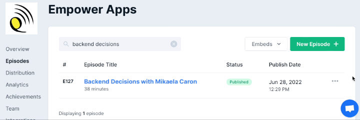
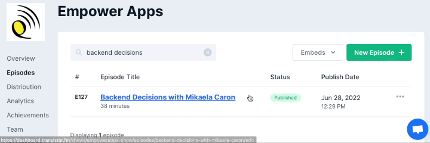
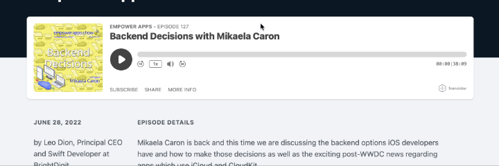
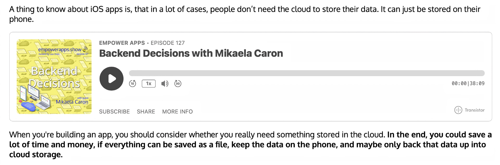

# TransistorPublishPlugin

A [Publish](https://github.com/JohnSundell/Publish) plugin that makes it easy to embed [Transistor](https://transistor.fm/?via=publish-plugin) podcasts in your posts on any Publish website.

[](https://swift.org)
[](http://twitter.com/brightdigit)


[](https://swiftpackageindex.com/brightdigit/TransistorPublishPlugin)
[](https://swiftpackageindex.com/brightdigit/TransistorPublishPlugin)


[](https://codecov.io/gh/brightdigit/TransistorPublishPlugin)
[](https://www.codefactor.io/repository/github/brightdigit/TransistorPublishPlugin)
[](https://codebeat.co/projects/github-com-brightdigit-npmpublishplugin-main)
[](https://codeclimate.com/github/brightdigit/TransistorPublishPlugin)
[](https://codeclimate.com/github/brightdigit/TransistorPublishPlugin)
[](https://codeclimate.com/github/brightdigit/TransistorPublishPlugin)
[](https://houndci.com)

# Table of Contents

* [Introduction](#introduction)
   * [Requirements](#requirements)
   * [Installation](#installation)
* [Usage](#usage)
* [References](#references)
* [License](#license)

# Introduction

Using blockquotes in your markdown, you can easily embed the [Transisitor](https://transistor.fm/?via=publish-plugin) podcast player in your website.

## Requirements 

**Apple Platforms**

- Xcode 14.3 or later
- Swift 5.8 or later

- macOS 12 or later deployment targets

**Linux**

- Ubuntu 18.04 or later
- Swift 5.8 or late

## Installation

To install it into your [Publish](https://github.com/johnsundell/publish) package, add it as a dependency within your `Package.swift` manifest:

```swift
let package = Package(
  ...
  dependencies: [
	  ...
	  .package(
		 url: "https://github.com/johnsundell/publish.git", 
		 from: "0.9.0"
	  ),
	  .package(
		url: "https://github.com/brightdigit/TransistorPublishPlugin.git",
		from: "1.0.0"
	  )
  ],
  targets: [
	.target(
	  ...
	  dependencies: [
		  ...
		  .product(name: "Publish", package: "publish"),
		  .product(name: "TransistorPublishPlugin", package: "TransistorPublishPlugin"),
	  ]
	)
  ]
  ...
)
```

Then import **TransistorPublishPlugin** wherever you’d like to use it:

```swift
import TransistorPublishPlugin
```

# Usage

There are two pieces to using the plugin:

First, add the plugin to your build steps:

```
try DeliciousRecipes().publish(using: [
    .installPlugin(.transistor()),
    .addMarkdownFiles(),
    .copyResources(),
    .addFavoriteItems(),
    .addDefaultSectionTitles(),
    .generateHTML(withTheme: .delicious),
    .generateRSSFeed(including: [.recipes]),
    .generateSiteMap(),
])
```

Lastly, get the share url from your podcast episode. On [Transistor](https://transistor.fm/?via=publish-plugin), this is known as either the podcast episode's simple share url or social media landing page:

**Copy the URL from the Episode List**


**Copy the URL from the Episode Page**


**Copy the URL from the Social Page**


In your article add a block quote with the url to a podcast episode:

```markdown
A thing to know about iOS apps is, that in a lot of cases, people don’t need the cloud to store their data. It can just be stored on their phone.

> transistor https://share.transistor.fm/s/67771090

When you're building an app, you should consider whether you really need something stored in the cloud. **In the end, you could save a lot of time and money, if everything can be saved as a file, keep the data on the phone, and maybe only back that data up into cloud storage.**
```

Now you should see the embed on your rendered page:


 
# References

* [Publish by John Sundell](https://github.com/JohnSundell/Publish)
* [transistor.fm](https://transistor.fm/?via=publish-plugin) 

# License 

This code is distributed under the MIT license. See the [LICENSE](https://github.com/brightdigit/TransistorPublishPlugin/LICENSE) file for more info.
